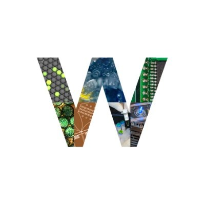

# Homepage
Página web del curso IBM2026 Prototyping for Bioengineers

> Esta es una página en construcción. Para mayor información revisar el archivo `README`

## Projects

En esta sección se encuentra los proyectos del curso **IBM2026**

  * Proyecto 01  
   Autor: Tomás  
   [Link a mi página web](https://www.google.com)

  * Proyecto 02  
   Autor: --  
   [Link a mi página web](https://www.google.com)

  * Proyecto 03  
   Autor: --  
   [Link a mi página web](https://www.google.com)

  * Proyecto 04  
   Autor: --  
   [Link a mi página web](https://www.google.com)

## About us

## Resources

[Guía de Markdown](https://www.markdownguide.org/basic-syntax)

### Wenzel Lab  
   [Twitter Wenzel lab](https://twitter.com/WenzelLab?ref_src=twsrc%5Egoogle%7Ctwcamp%5Eserp%7Ctwgr%5Eauthor)  
   

## Contact us
